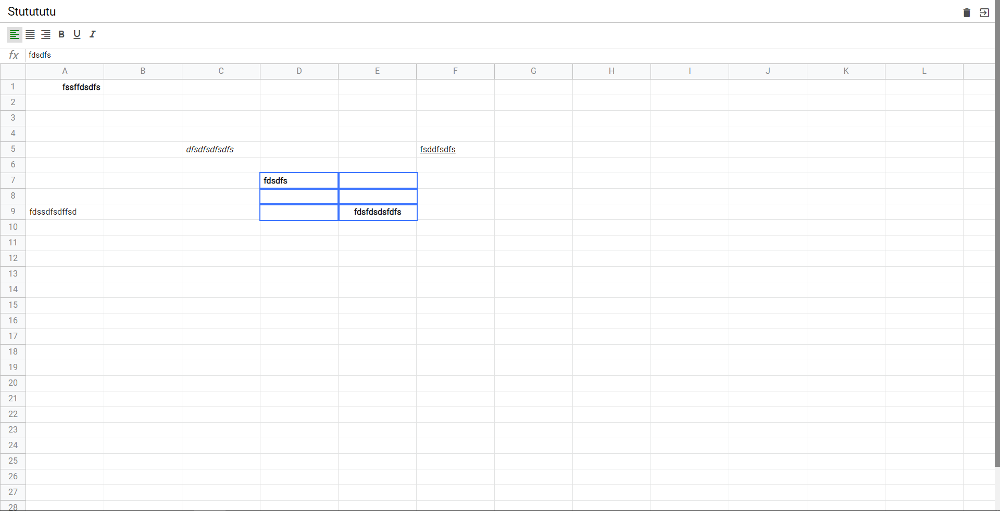
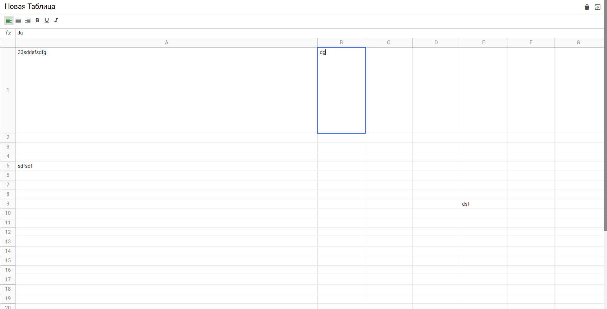
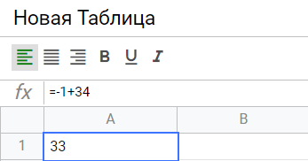

# Excel. Создай свою таблицу.

SPA приложение написанное на ванильном JavaScript.

# deploy: https://excel-project-wheat.vercel.app/

# Запуск проекта локально(временное решение) 🔥🔥🔥

```
eslint --fix .
npm start
```

# Примененные решения

- JavaScript
- ООП на JavaScript
- State Managers
- Вёрстка на SASS, SCSS
- Тестирование с Jest
- Data Layer
- Работа с Git
- Анализ кода с ESLint
- Настройка Webpack
- Шаблоны проектирования
- И многое другое


# Реализовано

-   Изменение стилей
-   Сохранение создание и удаление таблиц



-   Изменение размера ячеек



-   Формула

